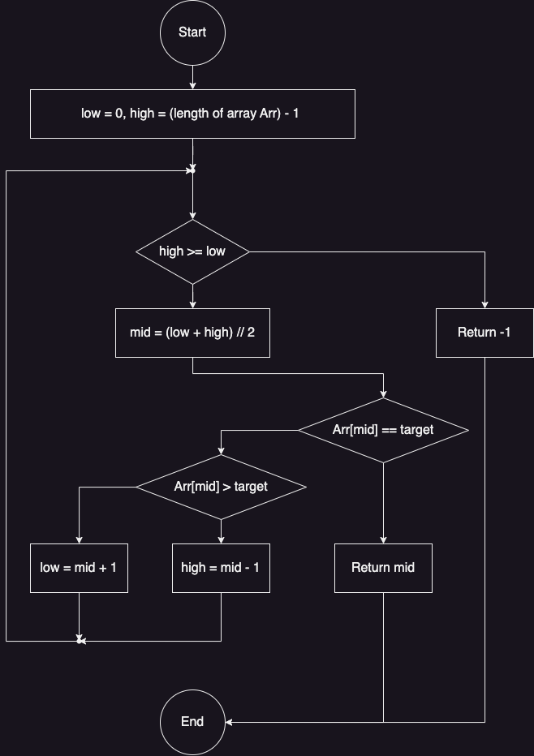

# binary search algorithm

## Pseudo Code

i used python syntax; for its simplicity.

<code>
    
    def binary_search(array,target):
    
        low, high = 0, len(array)-1
    
        while high >= low :
            mid  = (low + high)//2

            if array[mid] == target:
                return mid
        
            elif array[mid] > target:
                high = mid - 1

            else :
                low = mid + 1
                
        return -1
</code>

## Flow Chart

